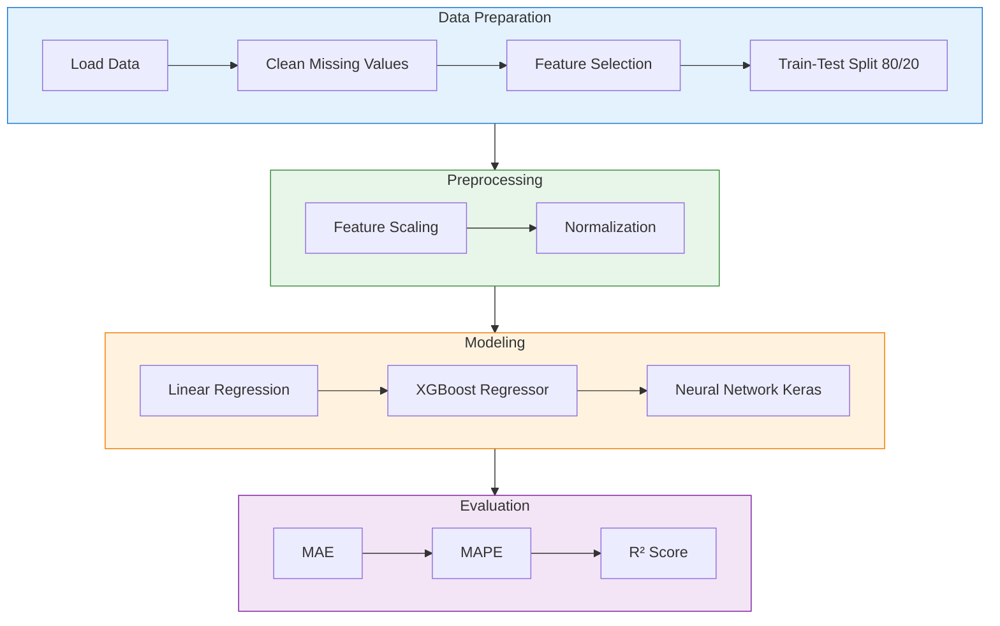
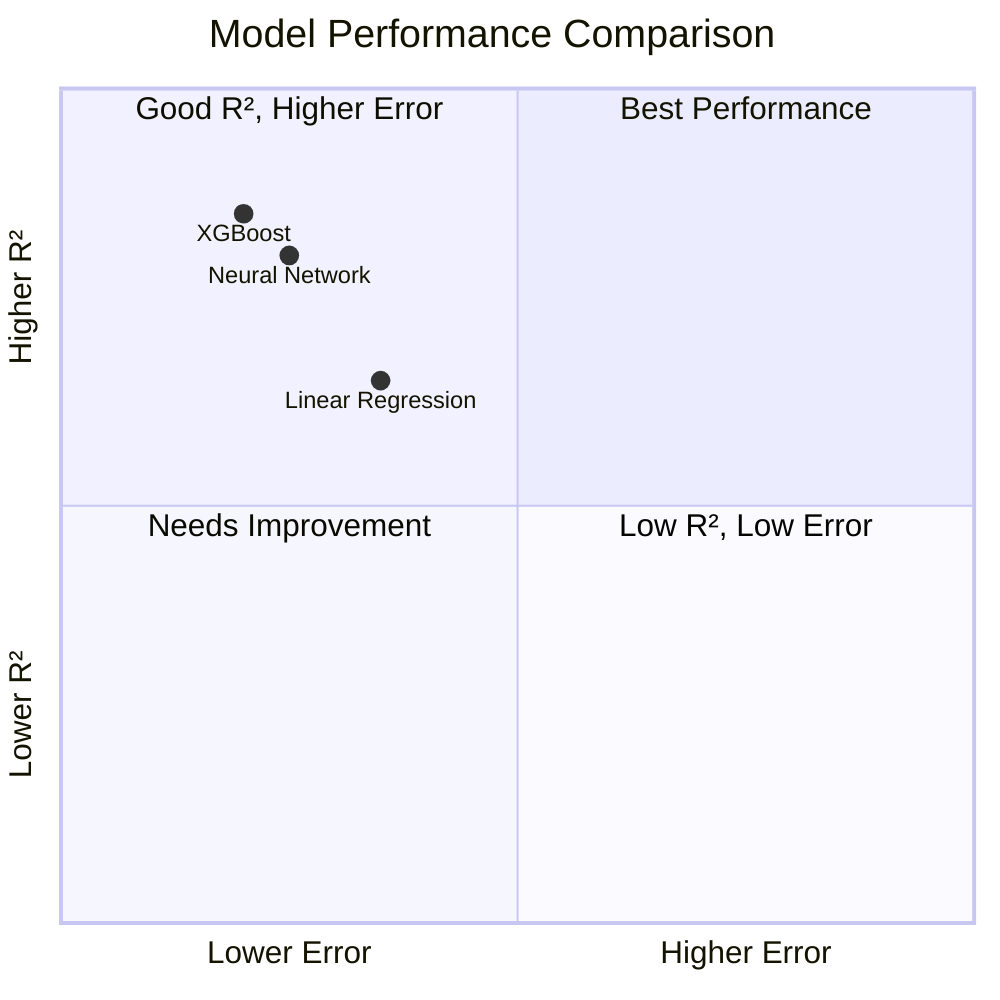

# Automotive Fuel Efficiency Regression

<div align="center">

[](https://github.com/<your-username>/<your-repository>)
[](https://opensource.org/licenses/MIT)
[](https://www.python.org/)
[](https://jupyter.org/)

[View Notebook](#running-the-notebook) • [Dataset](#dataset) • [Models](#models-and-evaluation) • [Results](#results) 

</div>

A machine learning project that analyzes automotive sensor data and predicts fuel efficiency in miles per gallon (MPG). The project explores relationships between vehicle speed, engine performance, fuel consumption, air flow, acceleration, and other measurements collected through an OBD-II interface.

---

## Overview

Fuel efficiency is influenced by several driving and engine-related factors, including vehicle speed, engine RPM, throttle position, acceleration, and fuel-flow rate. This project applies exploratory data analysis, feature engineering, data preprocessing, and regression techniques to model fuel efficiency from automotive monitoring data.

The analysis is based on the case study **"Fuel Efficiency Versus Speed"** from the *Machine Learning for Engineers: Automotive Monitoring* course.

---

## Project Workflow


---

## Objectives

- Analyze automotive sensor data collected through an OBD-II interface.
- Investigate how vehicle speed and engine parameters affect fuel efficiency.
- Calculate and model fuel efficiency in miles per gallon (MPG).
- Prepare and clean the dataset for machine learning.
- Train regression models to predict MPG.
- Evaluate model performance using standard regression metrics.
- Visualize relationships between automotive measurements and fuel consumption.

---

## Dataset

The dataset contains automotive monitoring and fuel-consumption measurements, including:

| Feature | Description |
|---------|-------------|
| `time` | Timestamp of measurement |
| `Average fuel consumption (MPG)` | Average fuel efficiency |
| `Average speed (mph)` | Average vehicle speed |
| `Vehicle speed (mph)` | Instantaneous vehicle speed |
| `Engine RPM (rpm)` | Engine revolutions per minute |
| `MPG` | Calculated instantaneous fuel consumption (target) |
| `Calculated instant fuel rate (gal./h)` | Instantaneous fuel flow rate |
| `Distance travelled (miles)` | Distance covered |
| `Fuel used (gallon)` | Fuel consumed |
| `Instant engine power (hp)` | Engine power output |
| `MAF air flow rate (g/sec)` | Mass air flow sensor reading |
| `Oxygen sensor 1 Wide Range Current (mA)` | O₂ sensor current |
| `Oxygen sensor 1 Wide Range Equivalence ratio` | Air-fuel ratio indicator |
| `Throttle position (%)` | Throttle opening percentage |
| `Vehicle acceleration (g)` | Vehicle acceleration |

The target variable used in the regression analysis is:

```text
MPG — Miles per gallon
```

The original calculated fuel-consumption column is renamed to `MPG` during preprocessing.

---

## Screenshots

### Exploratory Data Analysis

<div align="center">
  
  

    
  

  <p><em>Relationships between vehicle speed, RPM, and fuel efficiency</em></p>
</div>

### Model Predictions

<div align="center">
  

  <p><em>Actual vs. Predicted MPG values from regression models</em></p>
</div>

### Learning History

<div align="center">
  


  <p><em>loss vs validation loss</em></p>
</div>

### 3D plot

<div align="center">
  


  <p><em>Speed vs Acceleration vs RPM</em></p>
</div>

---

## Technologies Used

<div align="center">

| Technology | Purpose |
|------------|---------|
|  | Core programming language |
|  | Interactive notebook environment |
|  | Numerical computing |
|  | Data manipulation and analysis |
|  | Data visualization |
|  | Statistical visualization |
|  | Machine learning library |
|  | Gradient boosting framework |
|  | Neural network framework |
|  | High-level neural network API |

</div>

---

## Machine Learning Pipeline



---

## Models and Evaluation

The project includes regression-based machine learning experiments using tools such as:

- **Linear Regression** — Baseline model for understanding linear relationships.
- **XGBoost Regression** — Gradient boosting for capturing non-linear patterns.
- **Neural-Network Regression (Keras)** — Deep learning approach with multiple hidden layers.

### Evaluation Metrics

| Metric | Description | Formula |
|--------|-------------|---------|
| **MAE** | Mean Absolute Error | \(\frac{1}{n}\sum_{i=1}^{n} \|y_i - \hat{y}_i\|\) |
| **MAPE** | Mean Absolute Percentage Error | \(\frac{100\%}{n}\sum_{i=1}^{n} \left|\frac{y_i - \hat{y}_i}{y_i}\right|\) |
| **R²** | Coefficient of Determination | \(1 - \frac{\sum (y_i - \hat{y}_i)^2}{\sum (y_i - \bar{y})^2}\) |

The notebook also uses early stopping during neural-network training to help reduce unnecessary training and limit overfitting.

---

## Project Structure

```text
automotive-fuel-efficiency/
├── Automotive
    ├── Automotive_regression.ipynb
├── automotive.txt
└── README.md
```

> Place the dataset file in the expected project directory, or update the data-loading path in the notebook before execution.

---

## Installation

### Clone the Repository

```bash
git clone https://github.com/<your-username>/<your-repository>.git
cd <your-repository>
```

### Install Dependencies

```bash
pip install numpy pandas matplotlib seaborn scikit-learn xgboost keras tensorflow tqdm jupyter
```

Or use the provided `requirements.txt`:

```bash
pip install -r requirements.txt
```

---

## Running the Notebook

<div align="center">

[](https://colab.research.google.com/)
[](https://jupyter.org/)

</div>

### Local Execution

```bash
jupyter notebook
```

Then open:

```text
Automotive_regression.ipynb
```

Run the notebook cells sequentially from top to bottom.

### Google Colab

1. Upload `Automotive_regression.ipynb` and `automotive.txt` to Google Colab.
2. Update the data-loading path if necessary.
3. Run all cells using **Runtime → Run all**.

---

## Example Data Loading

The notebook currently loads the dataset using:

```python
url = "/content/automotive.txt"
data = pd.read_csv(url)
```

For local execution, update the path if necessary:

```python
data = pd.read_csv("automotive.txt")
```

---

## Results

The notebook produces:

- Dataset inspection and column summaries.
- Time-format transformations.
- Exploratory visualizations.
- Relationships between speed, RPM, acceleration, and MPG.
- Regression model predictions.
- Model evaluation using MAE, MAPE, and R².
- Comparisons between actual and predicted fuel-efficiency values.

Exact performance values may vary depending on preprocessing, feature selection, train-test split, random seed, and model hyperparameters.

---

## Model Comparison



> **Note:** Update the quadrant coordinates above with your actual model performance metrics.

---

## Key Insights

This project demonstrates how automotive sensor data can be used to estimate fuel efficiency. Measurements such as vehicle speed, engine RPM, throttle position, acceleration, fuel-flow rate, and air-flow rate provide useful signals for regression models.

However, fuel-efficiency predictions should be interpreted carefully because several sensor variables may be correlated with the target MPG value. In particular, variables that are directly calculated from fuel consumption may introduce data leakage if they are used as input features while predicting MPG.

---

## Limitations

- The model depends on the quality and reliability of the automotive sensor data.
- The dataset may not represent all driving conditions or vehicle types.
- Instantaneous MPG can be noisy and may contain extreme values.
- Random train-test splitting may not fully reflect the time-dependent nature of vehicle data.
- Features directly derived from fuel consumption should be reviewed carefully to prevent target leakage.
- Model performance may not generalize to vehicles or environments outside the dataset.


## Learning Resources

<div align="center">

[](https://apmonitor.com/pds)
[](https://www.apmonitor.com/pds/index.php/Main/AutomotiveMonitoring)
[](https://apmonitor.com/pds/index.php/Main/CourseSchedule)

</div>

- [Automotive Monitoring — Machine Learning for Engineers](https://www.apmonitor.com/pds/index.php/Main/AutomotiveMonitoring)
- [Machine Learning for Engineers Course Overview](https://apmonitor.com/pds)
- [Course Schedule](https://apmonitor.com/pds/index.php/Main/CourseSchedule)

---


## License

<div align="center">

[](https://opensource.org/licenses/MIT)

This project is intended for educational and research purposes.

</div>

---

<div align="center">

**If you found this project helpful, please consider starring the repository!** ⭐

[Back to Top](#automotive-fuel-efficiency-regression)

</div>
